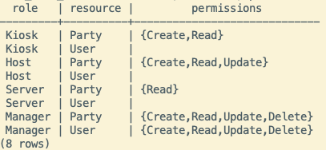
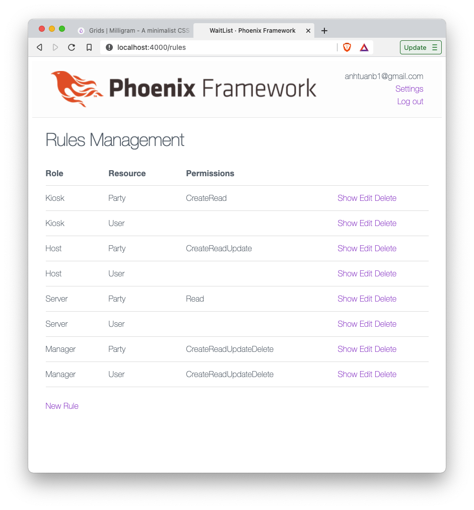

# WaitList

This wait list app is an experimented implement that imitates [KnowThen's WaitList App](https://github.com/knowthen/elixir_authorization_tutorial).
The implement here is without live-view and with following features:

  * RBAC using DB table (role, access): access_control_rules = Roles & Permissions ~~belongs to user~~
  * Use phx.gen.auth for authentication
  * Keep minimal css as an origin phx.new (aka miligram css)
  * Use Kaffy admin tool to manage/edit/control the access_control_rules, user_id --> user

## Initial Steps to generate the app

  * `mix phx.new wait_list --no-dashboard --binary-id`
  * `cd wait_list`
  * optional: `mix help phx.gen.auth` to see available options of phx.gen.auth
  * `mix phx.gen.auth Accounts User users --hashing-lib argon2`
  * `mix do deps.get, deps.compile`
  * `mix ecto.create`
  * `mix ecto.migrate`
  * `mix phx.server`
  * Clean the header part in `app.html.eex`, clean the body of `page/index.html.eex`
  * Create UserController and UserView and corresponding templates (:index, :edit, :update)
  * `mix phx.gen.html Reservation Party parties name:string size:integer status` then edit/modify/improve ...
  * Modify `templates/party/index.html.eex` to represent "Reserve" "Seat" "Cancel" button in one page, borrow the code from others `...templates/party/*.html.eex`
  * Implement RBAC similar to knowthen but with a table of `rules` stored Database

## Initial git commands

  * `git init`
  * `git add .`
  * `git commit -m "Initial commit"`
  * Create a remote repo in github.com then following the guide in the new created github page
  * `git branch -M main`
  * `git remote add origin https://github.com/tuan-karma/wait-list-RBAC.git`
  * `git push -u origin main`

## Screenshots

  

  
Fig. 1. Rules Table in Postgres database

  
  *Fig. 2. Screen shot of Rule management menu*

## Lưu ý
  * Một số chi tiết implement trong app này mang tính thử nghiệm và biểu diễn công nghệ. Người đọc sẽ cảm thấy các chỗ này hơi thừa. Ví dụ như các chỗ dùng ecto_enum và sử dụng hàm hidden_input trong template để chứa đường dẫn redirect[path] nhằm chuyển hướng về trang hiện tại khi xảy ra lỗi unauthorized.
  * App này nên được dùng để tham khảo để implement các hệ thống RBAC dựa trên bảng rules trong DB. Mấu chỗt của app này nằm ở context `Authorization` và plug `Authorize`. Chỉ cần bổ xung thêm cột `role:string` vào bảng `users` và cắm plug `Authorize` ở đầu các controller tương ứng với tài nguyên cần quản lý phân quyền là có thể hoạt động được ngay trên các app có sẵn.
  * Lưu ý: bảng users và các bảng users_tokens hoàn toàn được tạo tự động nhờ `phx.gen.auth`. Kiểu Authorization nhờ RBAC và plug minh họa ở đây rất là tiện lợi vì nó hoàn toàn không cần can thiệp đến logic có sẵn của app đang có.
  * Tôi tự đánh giá thiết kế và chất lượng code trong ví dụ này ngang với code mẫu của `phx.gen.auth` có giá trị tham khảo mẫu mực khá cao.